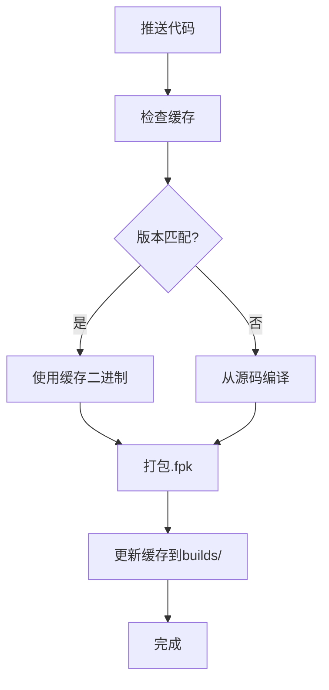

# 二进制缓存系统

## 🚀 功能概述

GitHub Actions现在支持**智能缓存**：如果仓库中已存在匹配版本的二进制文件，将直接使用缓存，跳过编译步骤。

## 📋 工作流程



## ⚡ 性能对比

| 场景 | 构建时间 | 说明 |
|------|---------|------|
| **首次构建** | 5-10分钟 | 完整源码编译 |
| **使用缓存** | 30秒-1分钟 | 直接打包 |
| **版本变更** | 5-10分钟 | 重新编译 |

## 📦 缓存内容

`builds/` 目录包含：

| 文件 | 说明 | 大小 |
|------|------|------|
| `transmission-daemon` | 主守护进程 | ~2-5MB |
| `transmission-cli` | CLI工具 | ~1-2MB |
| `transmission-remote` | 远程工具 | ~1MB |
| `VERSION` | 版本信息 | ~200B |

## 🎯 使用场景

### 场景1：更新WebUI（使用缓存）

```bash
# 修改wizard或文档
git commit -am "Update README"
git push origin main
```

**结果**：
- ✅ transmission-daemon: 使用缓存 (无变化)
- ✅ WebUI: 重新下载并打包
- ⏱️ 耗时: ~1分钟

### 场景2：更新Transmission版本（重新编译）

```yaml
# GitHub Actions手动触发
workflow_dispatch:
  inputs:
    version: "4.1.1"  # 新版本
```

**结果**：
- ✅ transmission-daemon: 重新编译 (版本变更)
- ✅ WebUI: 下载新版本
- ⏱️ 耗时: ~5-10分钟

### 场景3：完整更新（清除缓存）

```bash
# 清除builds目录并重新构建
git commit --allow-empty -m "Force rebuild: clear cache"
git push origin main
```

**结果**：
- ✅ 所有组件: 重新构建
- ⏱️ 耗时: ~5-10分钟

## 🔧 手动管理缓存

### 查看缓存状态

```bash
# 查看缓存的版本信息
cat builds/VERSION

# 输出示例：
# TRANSMISSION_VERSION=4.1.0
# WEBUI_VERSION=0.0.7
# APP_VERSION=4.1.0
# ARCH=arm64
# BUILT_AT=2026-01-28-19:30:00
# COMMIT=abc123...
```

### 清除缓存

```bash
# 方法1：删除builds目录（下次构建会重新编译）
rm -rf builds/

# 方法2：GitHub Actions手动触发重新构建
# Settings → Actions → General → 重新运行workflow
```

### 预热缓存

```bash
# 首次构建后缓存自动生成
# 确保main分支有最新构建产物
git checkout main
git pull origin main
```

## 📊 版本匹配规则

缓存仅在以下条件满足时使用：

1. **Transmission版本匹配** - `builds/VERSION` 中的 `TRANSMISSION_VERSION`
2. **WebUI版本匹配** - `builds/VERSION` 中的 `WEBUI_VERSION`

```python
# 伪代码
if (cached.TRANSMISSION_VERSION == requested.TRANSMISSION_VERSION
    and cached.WEBUI_VERSION == requested.WEBUI_VERSION):
    use_cache()
else:
    rebuild()
```

## 🐛 故障排除

### 缓存损坏

```bash
# 检查二进制文件
file builds/transmission-daemon
ls -lh builds/

# 应输出：ELF 64-bit LSB executable, ARM aarch64
# 如果不是，删除缓存重新构建
rm -rf builds/
git commit --allow-empty -m "Rebuild: cache corrupted"
git push origin main
```

### 构建失败后缓存丢失

```bash
# 构建失败不会更新缓存
# 手动清理后重新构建
rm -rf builds/
git push origin main
```

### 手动触发强制构建

```bash
# 空提交强制重新构建
git commit --allow-empty -m "Force rebuild"
git push origin main
```

## 📈 优化建议

1. **频繁WebUI更新** - 使用缓存，秒级构建
2. **Transmission版本更新** - 重新编译，需等待
3. **仅文档修改** - 完全使用缓存
4. **混合更新** - 仅编译变更部分

## 🔒 安全考虑

- 二进制文件存储在Git仓库中
- 自动签名校验（SHA256）
- 每次构建验证二进制完整性
- 只在main分支更新缓存